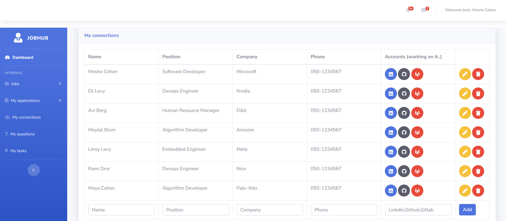

# JobHub


JobHub is a web application designed to help users find and track job offers from various companies. The application scrapes job listings from multiple company websites, allowing users to save job offers, track their applications, and manage their job search process effectively.

## Features

- **Job Scraping**: Automatically scrape job listings from multiple company websites.
- **Job Saving**: Save job offers that interest you for easy access later.
- **Application Tracking**: Keep track of the jobs you've applied to, including status updates and notes.
- **User Management**: User registration and login to keep your job search data private and secure.
- **Notifications**: Get notified about the latest job postings and updates to your saved jobs.
- **Email Alerts**: Receive email notifications when new job offers that match your preferences are available.
- **Notes**: Save notes about your saved jobs and applications for future reference.

## Screenshots

### Homepage


### Login


### Register


### Jobs

### Jobs


### Applications


### Connections

## Installation

## Installation

### Prerequisites

- Python 3.8 or higher
- Flask
- PostgreSQL
- Selenium

### Steps

1. Clone the repository:
   ```sh
   git clone https://github.com/yourusername/jobhub.git
   cd jobhub
2. Create a virtual environment and activate it:
   ```sh
   python -m venv venv
source venv/bin/activate  # On Windows use `venv\Scripts\activate`

3. Install the required packages:
   ```sh
   pip install -r requirements.txt

4. Create a new PostgreSQL database.
   Update the config.py file with your database credentials.
   
5. Run the application:
   ```sh
   python run.py


   
